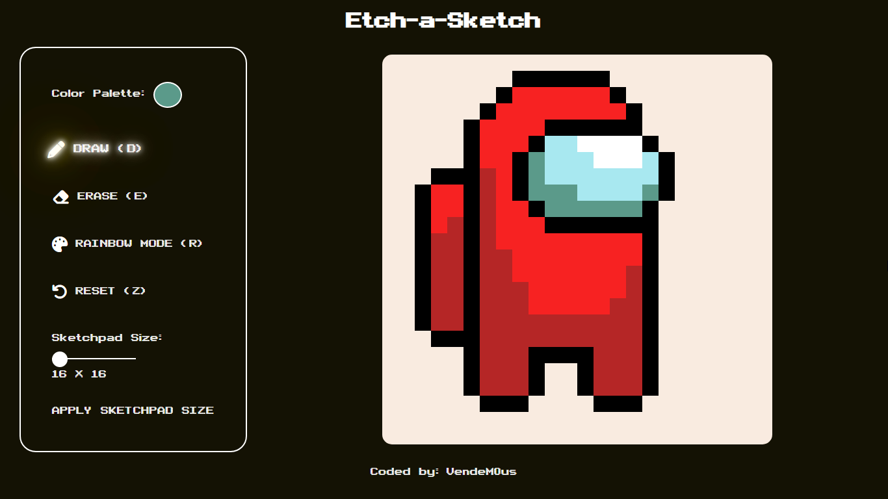
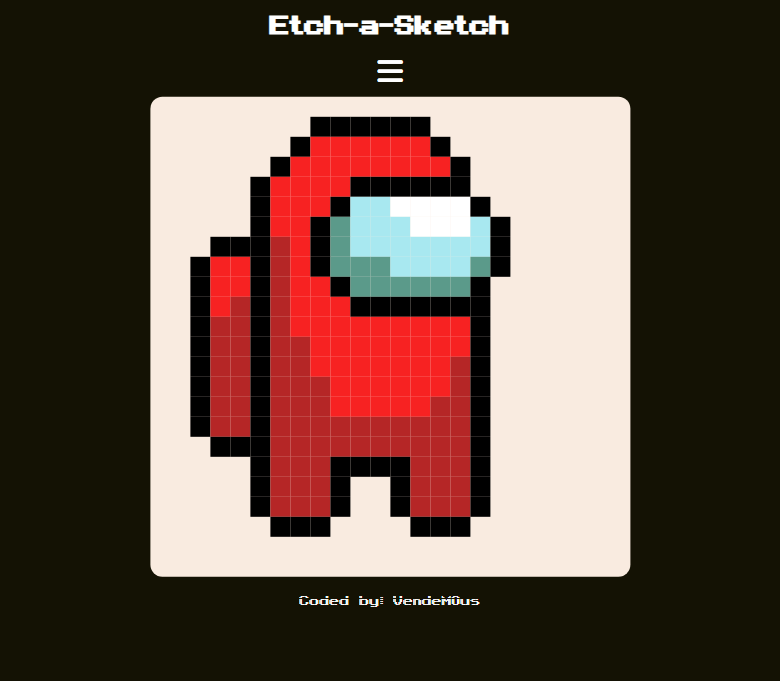
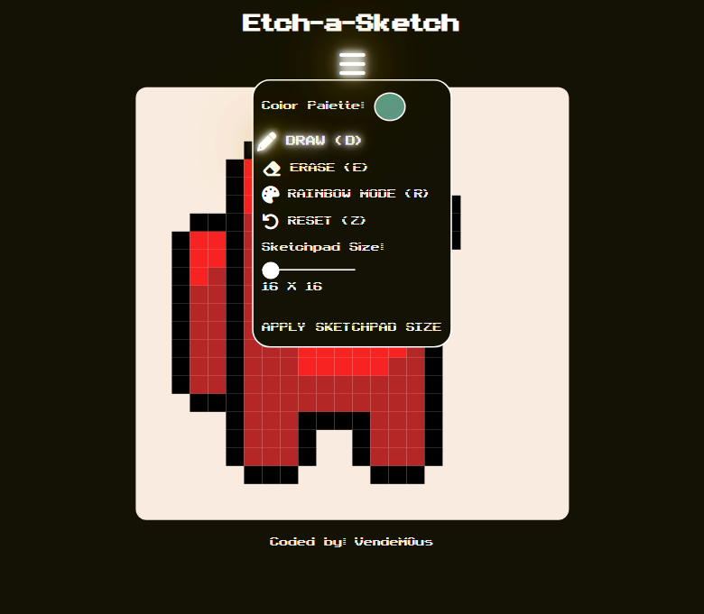

# etch-a-sketch
Simple html, css, and javascript etch-a-sketch game

## Features
* It implements the classic Etch-a-Sketch mechanical drawing toy.
* You can pick color from the color palette.
* It also have rainbow mode where different color values are painted every pixel.
* It handles local storage so you can save your work even after ending the session or the browser.

## Screenshots

